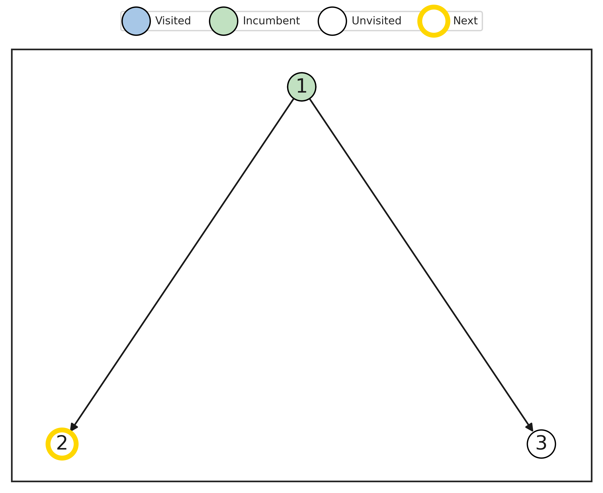

# TreeDQN: Learning to minimize Branch-and-Bound tree

This repository is the official implementation of [TreeDQN: Learning to minimize Branch-and-Bound tree](https://arxiv.org/abs/2306.05905). 


<p float="center">
  
</p>

## Setup environment


```bash
# pull docker image
docker pull idono/rlbnb:release

# run docker container
docker run -dit --gpus all --shm-size=10g --name rlbnb idono/rlbnb:release /bin/bash

# enter docker container
docker exec -it rlbnb /bin/bash

# work with TreeDQN
git clone https://github.com/dmitrySorokin/treedqn.git
conda activate bb

# work with baseline rl2branch
git clone https://github.com/lascavana/rl2branch.git
conda activate rl2branch
```

## Training

To train the RL agent, run this commands:

```bash
# generate validation data
python gen_instances.py --config-name <cfg from configs>

# run training
python main.py --config-name <cfg from configs>
```

To train the IL agent, run this commands:

```bash
# generate training data
python gen_imitation_data.py --config-name <cfg from configs>

# run training
python il_train.py --config-name <cfg from configs>
```

## Evaluation

To evaluate the agent, run:

```bash

python eval.py --config-name <cfg from configs> agent.name={agent_name}
```
* agent_name: strong, dqn, il, random
* results will be saved in results/{task_name}/{agent_name}.csv


## Pre-trained Models

Pretrained weights for IL, TreeDQN and REINFORCE agents are in models/ dir.

## P-P plots
To plot results, run:
```bash
python plot.py results/<task name>
```

## Results

Geometric mean of tree sizes (lower is better):

|Model | Comb.Auct | Set Cover | Max.Ind.Set. | Facility Loc. | Mult.Knap |
|------|-----------|-----------|--------------|---------------|----------------|
|Strong Branching | 48 $\pm$ 3 | 43 $\pm$ 2 | 40 $\pm$ 4 | 294 $\pm$ 9 | 700 $\pm$ 10 |
|IL      | 56 $\pm$ 3 | 53 $\pm$ 2 | 42 $\pm$ 5 | 323 $\pm$ 8 | 670 $\pm$ 9 |
|TreeDQN | **58 $\pm$ 3** | **56 $\pm$ 2** | **42 $\pm$ 6** | **324 $\pm$ 8** | **290 $\pm$ 6**|
|FMCTS   | 65 $\pm$ 3     | 76 $\pm$ 3     | 96 $\pm$ 8     | 499 $\pm$ 10    | 299 $\pm$ 6    |
|tmdp+DFS| 93 $\pm$ 3     | 204 $\pm$ 3    | 88 $\pm$ 4     | 521 $\pm$ 10    | 308 $\pm$ 6    |


## Contributing

Submit Github issue if you have any questions or want to contribute. 
